# Das PC-Wahl Desaster  

Krypto-Basics und wie man es NICHT macht

---

[Auszug aus Präsentation von Linus Neumann ( Sprecher CCC) zur 
Austellungseröffnung „Wahlcomputer“ im Heinz-Nixdorf-Forum 2017](http://www.linus-neumann.de/wp-content/uploads/2017/09/Mit-Papier-und-Bleistift-zur-sicheren-Wahl.mp4)


--- 

Wahl muss: 

* geheim, frei und gleich
* transparentes Verfahren und überprüfbare Resultate
* sicher gegen Manipulation 
* vertrauenswürdig

--- 

Computer bei Wahlen 

* 1990er Jahre; Forschungsprojekte
* 1999: Erster Einsatz Nedap-Wahlcomputer 
* 2002: Bundesinnenminister kündigt e-Voting für 2006 an 
* bis 2008 ca. 15 Millionen Stimmen an Nedap-Wahlcomputern abgegeben 

---


---

")

---

Verfassungsbeschwerde 

* gegen Bundestagswahl 2005 
* keine Möglichkeit zur Prüfung durch den Wähler
* keine Offenlegung der Systemunterlagen 
* Zweifel an der Sicherheit des Wahlsystems
* kein Bedarf: sicheres, akzeptiertes Wahlverfahren vorhanden 

---

**Urteil** 

Einsatz war verfassungswidrig

> Beim Einsatz elektronischer Wahlgeräte müssen die wesentlichen Schritte der Wahlbehandlung und Ergebnisermittlung von Bürgern zuverlässig und ohne Sachkenntnis überprüft werden können.

---


**Rule 1: Computers are evil!**

---

# PC-Wahl

Software zur Organisation, Wahlerfassung und -auswertung von Wahlen. 

---

Alternativen:

* IVU.elect
* Votemanager

--- 

## IVU.elect

getested im Januar 2017 von [Sijmen Ruwhof](https://sijmen.ruwhof.net/weblog/1166-how-to-hack-the-upcoming-dutch-elections)

---

How to hack the upcoming Dutch elections – and how hackers could have hacked all Dutch elections since 2009

---

```
1. Critical: Optional final paper audit.
2. Very low: Eight internal network shares (from an internal server called Amsterdam) are visible in a YouTube video
3. Medium: The voting-software initial installs a web server on the user’s computer. Users have to open a web browser before they can use the voting-software.
4. High: The voting software-application can be installed on any computer.
5. Medium: The browser for the election software connects to a local host via an unsecured HTTP connection.
6. High: Instructor skips important SHA1 check in YouTube video.
7. High: Voting software allows skipping SHA1 check.
8. High: The insecure, old and deprecated SHA1 hash algorithm is used everywhere in the software.
9. High: The voting software stores voting results in an unencrypted XML file.
10. Medium: PDF file with SHA1 hash code is stored next to corresponding XML file it has to protect.
11. Medium: The voting software / instructor does not mention that PDF files should be printed, nor enforces you to manually delete generated PDF files.
12. Medium: The architect designed the system, but it seems that this person doesn’t review the generated (security) documentation about it.
13. High: Non encrypted USB sticks are used.
14. High: Custom USB sticks can be used and these sticks can be loaded with malicious software.
15. Medium: Web browser automatically completes user passwords on a shared computer.
16. Medium: Instructor uses three letter password.
17. Low: A non personal user account is used.
18. Medium: No password strength policy is in place.
19. Low: The Java session identifier is visible in the internet address.
20. Medium: Instructor uses Windows administrator account instead of low privileged account. The software allows this.
21. Medium: Software saves high integrity XML files into a public location on the computer.
22. High: No automatic SHA1 hash check is in place for XML files stored on the computer.
23. High: Voting results are sent via an unencrypted e-mail over the internet.
24. High: Most sensitive operations in voting software have least SHA1 protection.
25. Etc. etc.
```
@[4]
@[6-9]
@[13-14]
@[22-24]
@[1]
@[25]

--- 

# PC-Wahl 

* Bundestagswahl 24. September 2017
* 32 000 000 Stimmen
* 30 Jahre Entwicklung
 
---

Vote IT zu Einsatz der Software PC-Wahl: 

 „in allen Flächenbundesländern bei Kommunalwahlen, Kreiswahlen, Landtagswahlen,
Bundestagswahlen, Europawahlen und Volksabstimmungen eingesetzt.“

---

### Theorie 1

---

**Key Concepts**

* Confidentiality (Vertraulichkeit)
* Integrity (Unversehrtheit)
* Availability (Verfügbarkeit)
* Non-repudiation (Nicht-Abstreitbarkeit)

---


---

**13 Tage bis zur Wahl**

Erstveröffentlichung PC-Wahl-Bericht 

[Thorsten Schröder, Linus Neumann, Martin Tschirsich](https://ccc.de/system/uploads/230/original/PC-Wahl_Bericht_CCC.pdf)

---


**Rule 2: Security by Obscurity is evil!**

---

# Infrastruktur

---

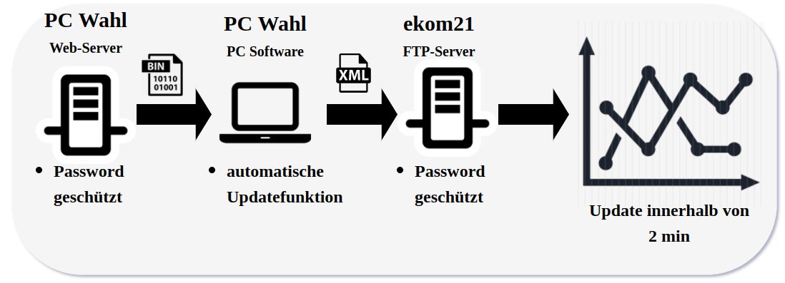

---

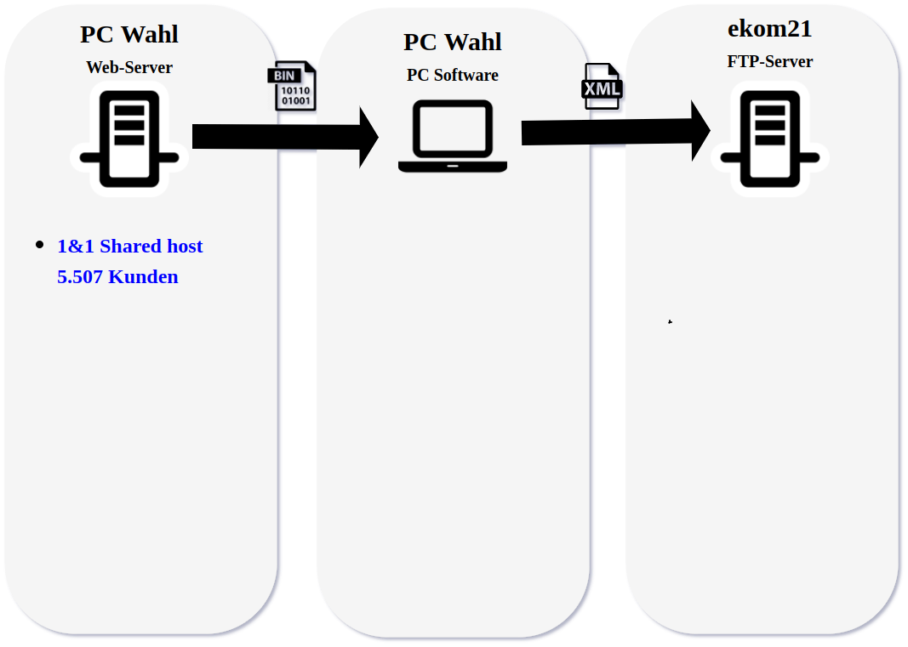

---


**Rule 3: Know your infrastructure, otherwise you could meet evil people!** 

---

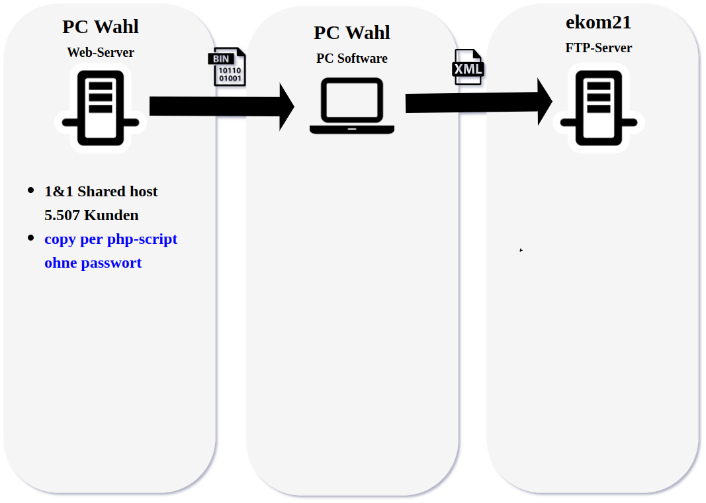

---

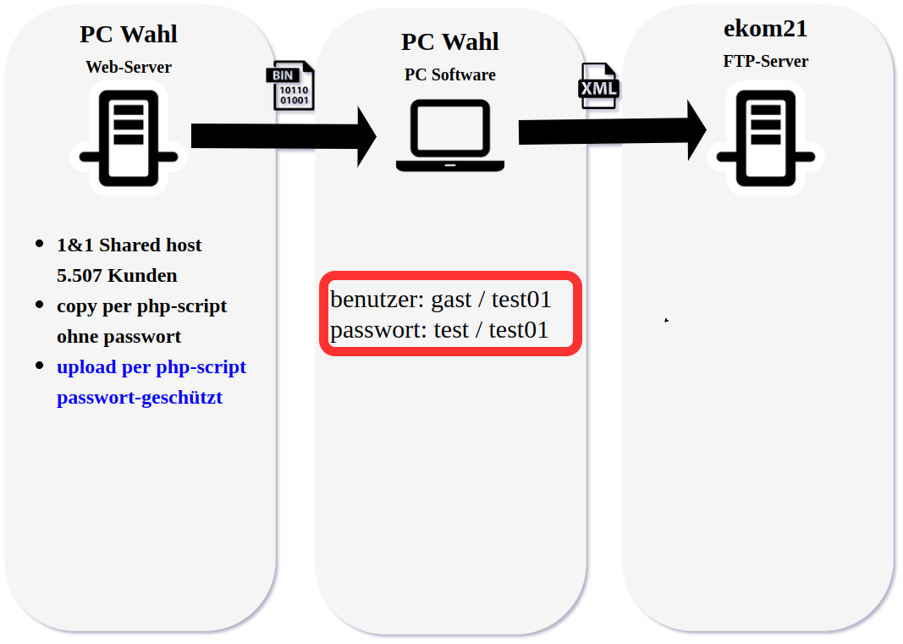

---

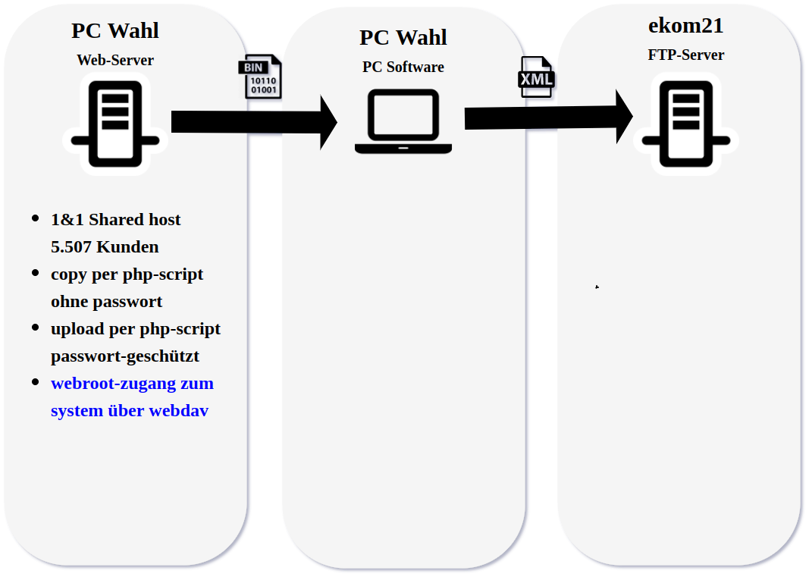

---

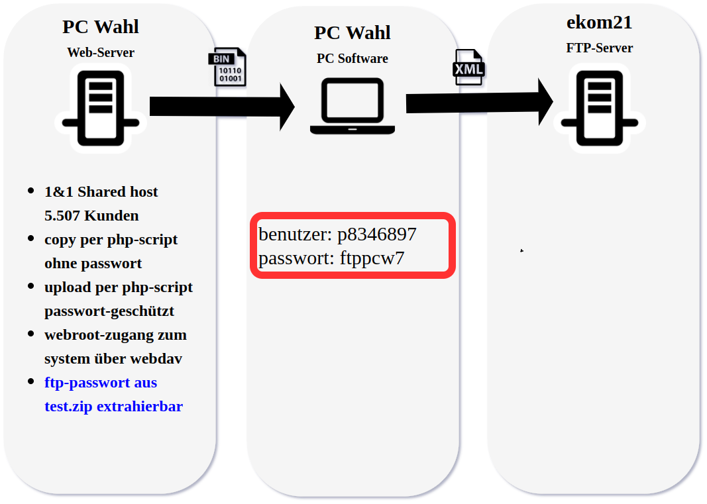

---


**Rule 4: Testcode in production is evil!**

---

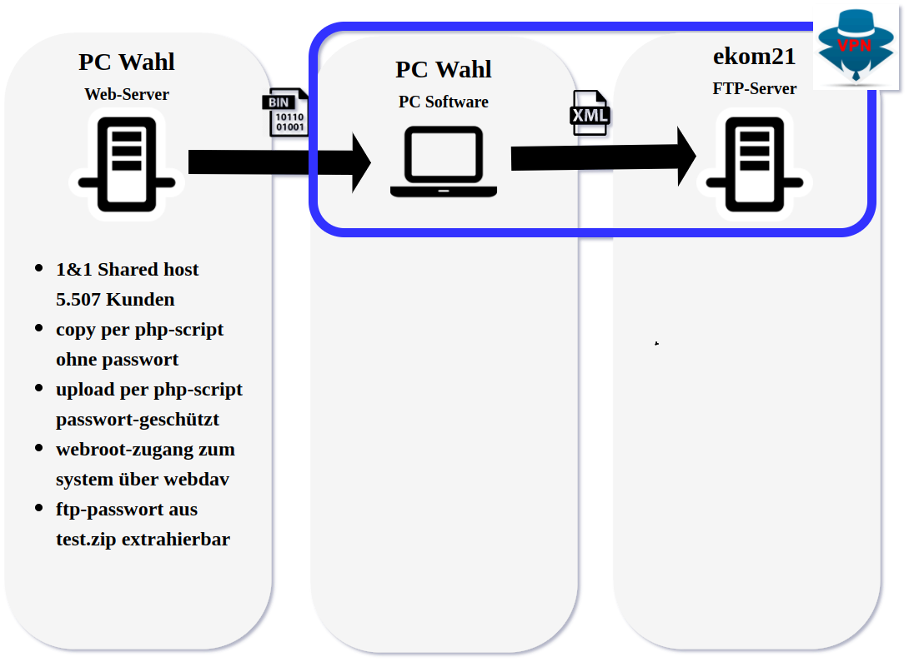

---

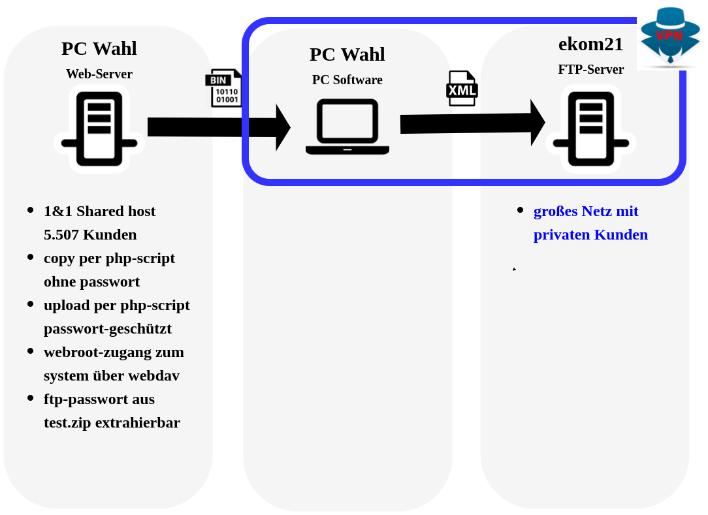

---

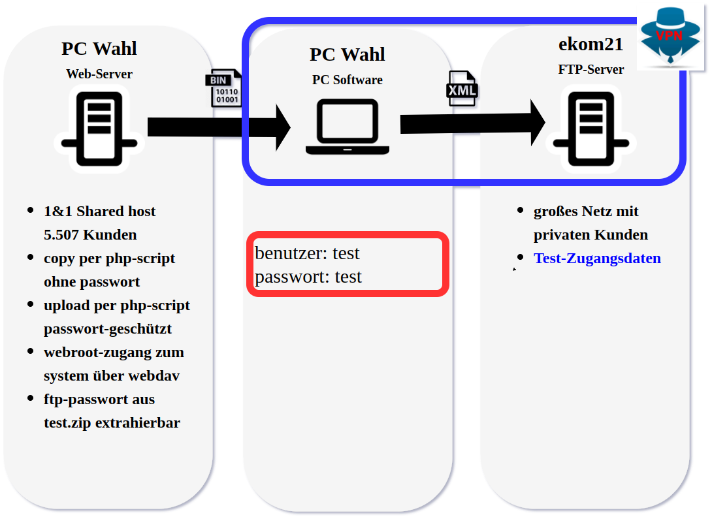

---

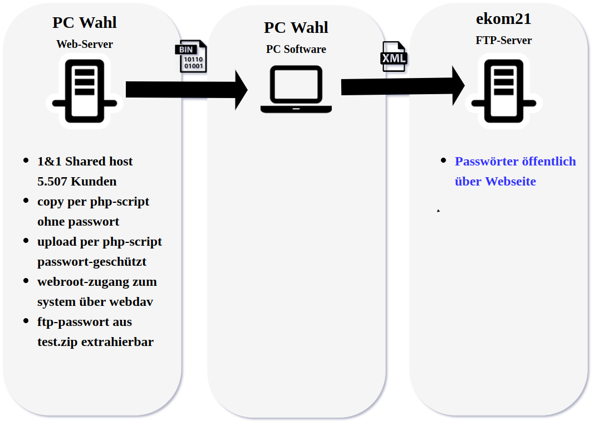

---

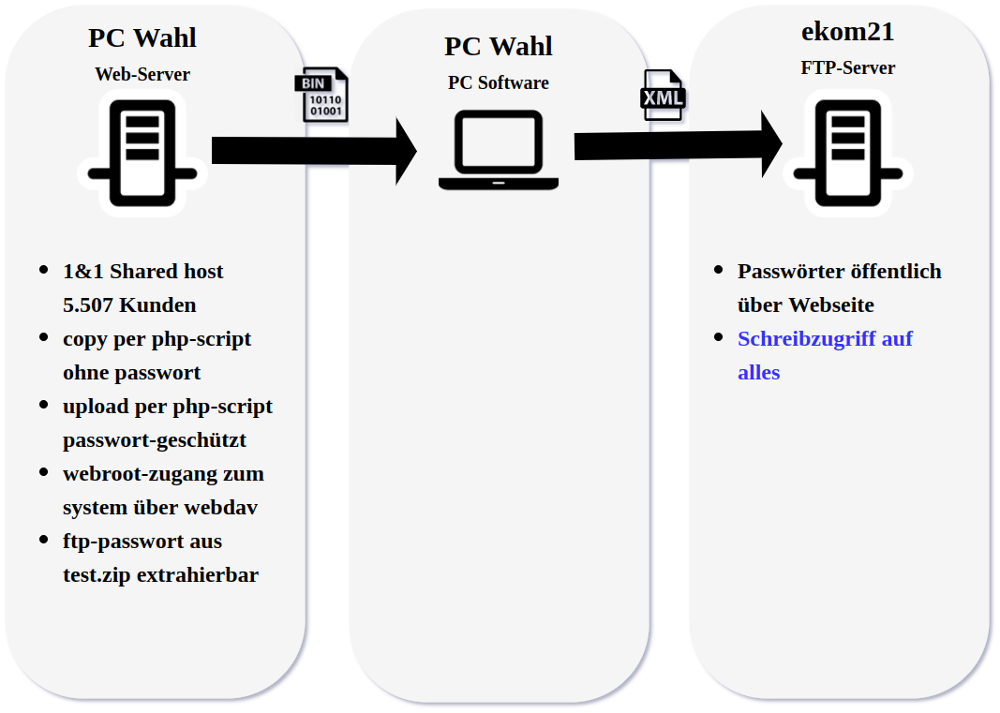

---

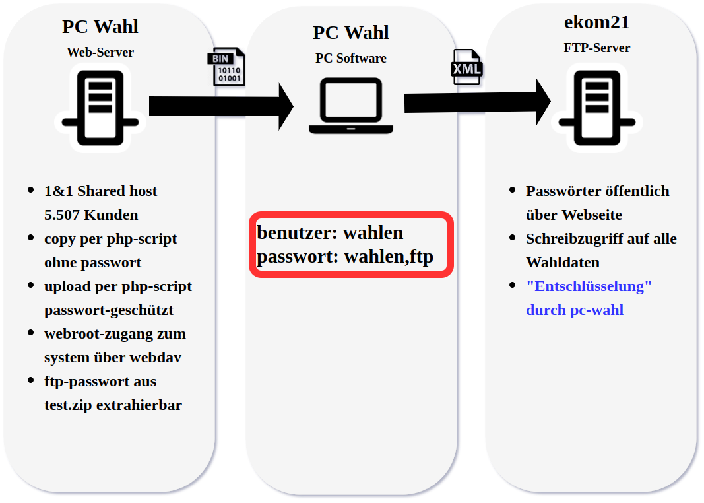

---


**Rule 5: Identify and Protect your sensitive Data, otherwise you are evil!**

---

CCC informiert PC-Wahl Team

---

Durchgeführte Aktionen: 

* Dateien mit Endung php werden nicht mehr ausgeführt
* PHP-Skripte nach wie vor auf Server
* FTP-Zugangsdaten wurden geändert 
* CPR-Dateien nur noch nach Eingabe des Passworts möglich 
* AES-Option besteht und "soll" verwendet werden. 

Ab hier keine weiteren Überprüfungen durch ccc möglich.  

---

CCC informiert ekom21

---

Abgeleitete Aktionen: 

* FTP-Modul wird vom öffentlichen Server entfernt
* Einige CPR-Dateien werden entfernt

---

CCC informiert ekom21 über weitere CPR-Dateien 

--- 

geplante Aktionen: 

* statt FTP soll SFTP zum Einsatz kommen (Entschlüsselung immer noch möglich)
* statt einem globalen Benutzer, ein Benutzer pro Wahlkreis

---

*6. September 2017*

* Umzug von http://wahlinfo.ekom21.de nach Umzug von https://wahlinfo.ekom21.de/wahlen
* FTP-Modul wird wieder öffentlich Bereitgestellt 

---

# Kerckhoffs’ Prinzip

Bereits 1883 postulierte Auguste Kerckhoffs den Verschlüsselungsgrundsatz, dass die
Sicherheit eines Verschlüsselungsverfahrens einzig auf der Geheimhaltung des Schlüssels,
nicht jedoch auf der Geheimhaltung des Verschlüsselungsalgorithmus beruhen soll.

---


**Rule 6: Hiding your crypto is evil!**

---

# Theorie

---

## Hashes und MACs

---

**Salt?**

---

**MD5** 

---

* 128 bit 
* gebrochen

--- 

**SHA-1**

---

* Feb 2005: 2^80 auf 2^69 
* Aug 2005: 2^63 
* Aug 2006: gefälschten Nachricht (derzeit bis zu 25 %)
* ...
* Feb 2017: erste Kollision

---

**SHA-2** 

---

* SHA-224, SHA-256, SHA-384, SHA-512
* gilt als sicher

---

**use SHA-2 (SHA-256) whenever possible**

---

**use procedures like PBKDF2, bcrypt or scrypt for passwords**

---

## Symetrische Verschlüsselung

---

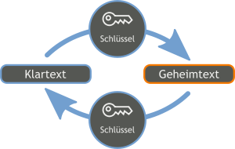

--- 

**RC4**

---

* Weit verbreitet
* gebrochen.

---

**DES**

---

* Weit verbreitet
* 56 Bit 
* Nachfolger: 3DES (schlechte Performance)

---

**Blowfish**

---

* 32-448 Bit 
* Schnell
* Langsame Schlüsselerzeugung

---

**AES**

---

* 128, 192, 256 Bit
* hohe Effizienz bei Implementierung in Verschlüsselungssoftware oder –hardware
* Sicherheit gegen bekannte kryptografische Angriffe

---

**use AES (AES with 256bit) whenever possible**

---

## Asymetrische Verschlüsselung

---

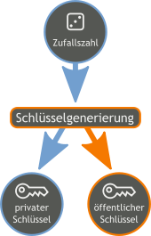

---


---

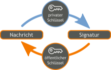

---

* Diffie-Hellman
* RSA
* ElGamal
* ECC-Verfahren (Curve25519 ...)
* ...

---

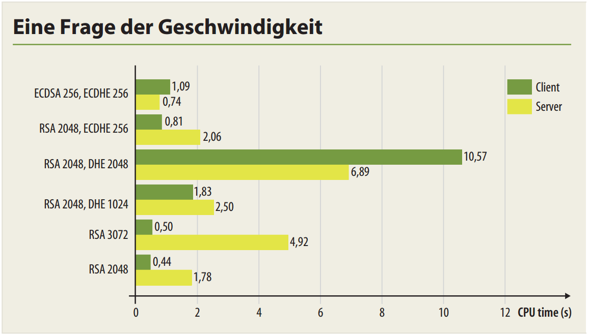

---

**use ECC (Curve25519, ...) or RSA + DH (>2048) whenever possible**

---

## Digitale Signaturen

---


---

## chain of trust

---

### certificate authority

---

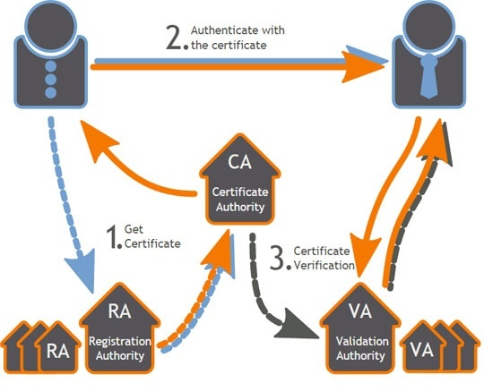

---

### secure boot

---

## Integrität der Software

keine Prüfung der Authentizität 

---

Erster Behebungsversuch: MD5-Prüfsummen (31. August 2017)

---

Im ZIP-Archiv befindet sich jetzt eine MD5-Prüfsummen-Datei

---

Zweiter Behebungsversuch: „Digitale Signatur“ (5. September 2017)

---

studio.exe jetzt signiert mit Comodo-Zertifikat des Herstellers regio iT, wird aber nicht überprüft. 

---

Dritter Behebungsversuch: „Digital signierte Installationspakete“ (13. September 2017)

---

* Software jetzt eingepackt in "Hello world"-Applikation
* Nutzer muss manuell den Fingerprint prüfen
* Sonst bleibt alles gleich
* Austausch der Applikation möglich ( ccc <24h )  

---

CCC empfiehlt: 

* verwendung signierter Microsoft-Installer (MSI)
* Einsatz eines eigens erstellten Hersteller Zertifikats 
* Standard-Verfahren

---


**Rule 7: roll your own crypto is evil! Use standard tooling.**

---

## Authentizität übertragener Daten

---

* keine kryptografische Signatur
* Manipulationen möglich

in Kombination mit vorherigen Themen "suboptimal" ;) 


---

Erster Behebungsversuch: GPG-Signaturen

---

GPG-Passphrase wird über die Kommandozeile übergeben

---

* externes Tool Gpg4win
* separat installiert

---

```
--passphrase string
 Use string as the passphrase. This can only be used if only one
 passphrase is supplied. Obviously, this is of very questionable
 security on a multi-user system. Don't use this option if you
 can avoid it.

```
---

GPG-Passphrase wird unverschlüsselt gespeichert

---

* GPG Schlüssel wird in pipe.txt geschrieben
* PC-Wahlserver hat eigenen FTP-Server, der Zugriff auf diese Datei gewährt

---

GPG-Passphrase wird mangelhaft „verschlüsselt“ gespeichert

---

* GPG-Passphrase wird in datei LOG000.INI gespeichert 
* eigens entwickelte „Verschlüsselungsroutine“ wird verwendet

---


**Rule 8:  using "Handmade" crypto-alogrithm is very, very evil!**

---

CCC empfiehlt: 

* Einrichtung von mehr als 10.000 Wahllokalen mit Schlüsseln unpraktikabel
* Einsatz einer PKI 
* Einsatz von Smart-Cards (z.B. USB-Stick)

---

CCC Hacking Tools:

https://github.com/devio/Walruss

---

# Wie gehts jetzt "richtig"?

Spende des CCCs: 

https://github.com/devio/Walruss/tree/master/pcw_rsa_donation

---

## Daten signieren

```csharp

using System.Security;
using System.Security.Cryptography;
using System.Security.Cryptography.X509Certificates;
...

public static string Sign(String xml_private_key, String input_file)
{
    // Detached signature is located at original-filename.ext.sig
    String signature_file = input_file + ".sig";
    byte[] signature;

    // Use RSACng because we want to use RSA Probabilistic Signature Scheme (PSS)
    using (var rsa = new RSACng())
    {
        rsa.FromXmlString(xml_private_key);

        try
        {
            // Data file to be signed
            Stream input_stream = File.OpenRead(input_file);

            // Sign data with private RSA key, using SHA512 and RSA-PSS
            signature = rsa.SignData(input_stream, HashAlgorithmName.SHA512, RSASignaturePadding.Pss);

            // Write signature to detached .sig file.
            File.WriteAllText(signature_file, Convert.ToBase64String(signature));
        }
        catch (Exception e)
        {
            Console.WriteLine("[e] Sign error: " + e.Message);
            return null;
        }
    }
    // Return signature data base64 encoded
    return Convert.ToBase64String(signature);
}


```

---


## Signatur überprüfen


```csharp

public static bool Verify(String xml_public_key, String input_file)
{
    // Detached signature is located at original-filename.ext.sig
    String signature_file = input_file + ".sig";

    Boolean success = false;

    // Use RSACng because we want to use RSA Probabilistic Signature Scheme (PSS)
    using (var rsa = new RSACng())
    {
        rsa.FromXmlString(xml_public_key);

        try
        {
            // Convert base64 encoded signature to byte-array
            byte[] signature = Convert.FromBase64String(File.ReadAllText(signature_file));

            // Data file that has been signed
            Stream input_stream = File.OpenRead(input_file);

            // Verify data with public RSA key, using SHA512 and RSA-PSS
            success = rsa.VerifyData(input_stream, signature, HashAlgorithmName.SHA512, RSASignaturePadding.Pss);
        }
        catch (Exception e)
        {
            Console.WriteLine("[e] Verify error: " + e.Message);
            return false;
        }
    }
    return success;
}

```

---

## Validieren der Installationsdatei

```csharp

using System.Security;

...

static void Main(string[] args)
{
    if (args.Length < 1) {
        usage();
        return;
    }

    // This code must be used/implemented on vendor side when deploying update data packages
    if (args[0].Equals("-sign"))
    {
        String res = null;

        if (args.Length < 3)
        {
            usage();
            return;
        }

        // Read XML encoded RSA private key from file (args1) and pass path 
        //    to input data (args2)
        res = Walruss.Updates.Data.Sign(File.ReadAllText(args[1]), args[2]);

        Console.WriteLine("[d] RSA Sign - Result: " + res);
    }
    // This code must be used/implemented in the updater program.
    else if (args[0].Equals("-verify"))
    {
        Boolean res = false;

        if (args.Length < 2)
        {
            usage();
            return;
        }

        // <blink>Put this in programmaktualisierung10.exe</blink>
        res = Walruss.Updates.Data.Verify(VENDOR_RSA_PUBLIC_KEY, args[1]);

        Console.WriteLine("[d] RSA Verify - Result: " + res);

        if (res == true)
        {
            // Signature OK
            // Proceed ...
        }
        else
        {
            // Signature not OK
            // Terminate Program
        }
    }
    else
    {
        usage();
        return;
    }
}
```
@[2]
@[24-28]
@[40-56]

---
